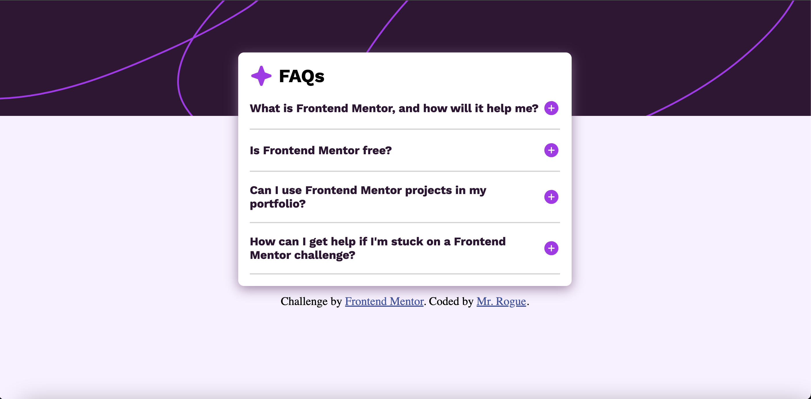

# Frontend Mentor - FAQ accordion solution

This is a solution to the [FAQ accordion challenge on Frontend Mentor](https://www.frontendmentor.io/challenges/faq-accordion-wyfFdeBwBz). Frontend Mentor challenges help you improve your coding skills by building realistic projects.

## Table of contents

- [Overview](#overview)
  - [The challenge](#the-challenge)
  - [Screenshot](#screenshot)
  - [Links](#links)
- [My process](#my-process)
  - [Built with](#built-with)
  - [What I learned](#what-i-learned)
  - [Continued development](#continued-development)
  - [Useful resources](#useful-resources)
- [Author](#author)
- [Acknowledgments](#acknowledgments)

**Note: Delete this note and update the table of contents based on what sections you keep.**

## Overview

### The challenge

Users should be able to:

- Hide/Show the answer to a question when the question is clicked
- Navigate the questions and hide/show answers using keyboard navigation alone
- View the optimal layout for the interface depending on their device's screen size
- See hover and focus states for all interactive elements on the page

### Screenshot




Here is a screenshot of the desktop and mobile version of my project.

### Links

- Solution URL: [Add solution URL here](https://github.com/vernonroque/faq-accordion.git)
- Live Site URL: [Add live site URL here](https://faq-accordion-project-rogue.netlify.app/)

## My process

### Built with

- Semantic HTML5 markup
- CSS custom properties
- Flexbox
- Desktop-first workflow
- [JQuery](https://jquery.com/) - JS library

### What I learned

Use this section to recap over some of your major learnings while working through this project. Writing these out and providing code samples of areas you want to highlight is a great way to reinforce your own knowledge.

1. JQuery method .closest()
   I learned how to use the .closest() method in javascript. I didn't know that this
   method works up the dom tree until it finds the query you are looking for. Here is an example of how I used it in my project:

````js
$('.answer-icon').on('click',(event)=>{
  //closest() traverses up the dom tree to find the closest ancestor
  $(event.currentTarget).closest('.question').find('.answer').toggleClass('active');
})

2. I learned how to change an attribute in javascript
I needed to change the src attribute for an image tag whenever the user clicked on the plus icon. Here is how I did it:

``` js

$('.question-headliner').on('click',(event)=>{
   const srcAttr = $(event.currentTarget).find('.answer-icon').attr("src");

   if(srcAttr === './assets/images/icon-plus.svg')
       $(event.currentTarget).find('.answer-icon').attr("src", "./assets/images/icon-minus.svg");
  else
       $(event.currentTarget).find('.answer-icon').attr("src", "./assets/images/icon-plus.svg");
})

````

3. I learned about event bubbling
   I came across an issue that was caused by event bubbling. I added an event listener to the plus icon. However, I also added and event listener to its parent container. This caused unexpected behavior. I solved the problem by stopping the event propogation:

```js
$(".answer-icon").on("click", (event) => {
  event.stopPropagation(); // Stop event propagation
});
```

4. I learned how to toggle classes
   I learned how to toggle a class. I needed to do this to toggle the appearance of the answers for each question.

```js
$(".answer-icon").on("click", (event) => {
  //I used the .toggleClass() method
  $(event.currentTarget)
    .closest(".question")
    .find(".answer")
    .toggleClass("active");
});
```

5. I learned about specificity
   I was encountering problems when i tried to add the class ".active" whenever a plus icon was clicked. I had to to write the css code like this to work properly:

```css
.answer.active {
  display: block;
}
.answer {
  display: none;
  color: hsl(292, 16%, 49%);
  font-family: "Work Sans", Arial, Helvetica, sans-serif;
  margin-top: 5px;
  line-height: 1.5;
}
```

I had to make sure the .answer container also was targeted with .active. In other words, I couldn't do this:

```css
.answer .active {
  display: block;
}
```

this is wrong. It caused some specifity problems. the .answer class and the .active class conflicted with each other. I had to target the container with both the classes.

6. I learned about last child pseudo code
   I didn't know that I could target the last-child in a group of siblings for particular styling. I also didn't know that I could style all sibling elements a particular way, and not style the last child. Here is my example:

```css
/* you can do it this way to remove the bottom border of the last child */
.question:last-child {
  border-bottom: none;
}
/*or*/

/* you can style all elements a certain way, except the last child */
.question:not(:last-child) {
  border-bottom: 2px solid #d3d3d3;
}
```

### Continued development

I would still like to practice more with JQuery. I'd also like to practice more with adding classes to containers whenever an event listener happens

### Useful resources

- [Chat GPT](https://chat.openai.com/) - This helped me debug my css problem. It also helped me debug my JQuery issues
- [w3 schools](https://www.w3schools.com/jquery/default.asp) - This helped me review useful Jquery methods

## Author

- Website - [Vernon Roque developer portfolio](https://developer-portfolio-8cc0c.web.app/)
- Frontend Mentor - [@vernonroque](https://www.frontendmentor.io/profile/yourusername)
- LinkedIn - [@vernon roque](https://www.linkedin.com/in/vernon-roque-84724235/)
- Git Hub - [@vernonroque](https://github.com/vernonroque)

## Acknowledgments

Thank you universe. Thank you baus.
